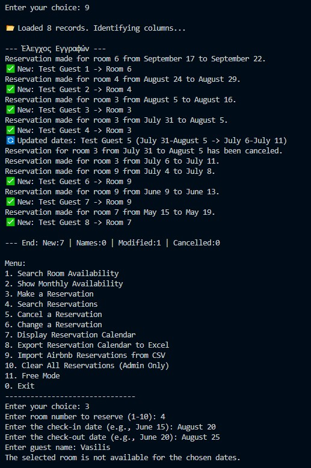

# 🏨 Hotel Reservation Management System (Prototype)

> **🚧 Status: Under Development**
> This project is currently in the prototype phase, designed to digitize the operations of a specific family-owned hotel. It is being actively developed to include Data Analytics features.

A Python-based desktop tool designed to manage room reservations, prevent double-bookings, and visualize availability. It replaces manual pen-and-paper tracking with a digital database using NumPy and Pandas.

## 🎯 Project Goal
The main objective is to create a system that handles:
* **Reservation Logic:** Preventing overlaps and managing check-in/check-out dates.
* **Platform Synchronization:** Parsing CSV exports from Airbnb to update the local calendar.
* **Data Structure:** Using efficient matrix operations (NumPy) to store availability for fast retrieval.

## 🛠️ Tech Stack
* **Python 3.x**
* **NumPy:** For grid-based availability tracking.
* **Pandas:** For data manipulation, CSV parsing, and Excel reporting.
* ## 📸 Demo
Running the system: Importing external bookings and testing the collision detection algorithm.

## ⚠️ Configuration & Customization (Read Before Use)
**Note:** This system is currently hardcoded for a specific **10-room hospitality business**. To run this for your own use case, you will need to modify specific parts of the code:

1.  **Room Mapping (Airbnb Integration):**
    The system maps specific Airbnb listing titles (e.g., *"Surfers Harmony"*) to internal room numbers (1-10).
    * *Action:* Locate the `room_map` dictionary inside the `import_airbnb_calendar` function.
    * *Modification:* Replace the keys with your own Airbnb listing titles.

2.  **Room Count:**
    The reservation grid is initialized for **10 rooms**.
    * *Action:* If you have a different number of rooms, you will need to adjust the array initialization (`np.zeros((10, 31)...`) in the Data Initialization section.

3.  **Admin Security:**
    * The "Clear All Data" function is protected by a hardcoded PIN (`admin`). You should change this in the `clear_all` function for security.

## 🚀 Future Roadmap
The next phase of development focuses on **Data Science & Business Intelligence**:
* [ ] **Analytics Dashboard:** Visualize occupancy rates and revenue per room.
* [ ] **Forecasting:** Implement time-series analysis to predict high-demand periods.
* [ ] **SQL Integration:** Migrate from `.npy` files to a relational database (SQL) for better scalability.
* [ ] **Dynamic Configuration:** Load room settings from a config file.

## 📬 Contact

Created by **Vasilis Dimitrokallis** - [LinkedIn Profile](https://www.linkedin.com/in/vasilis-dimitrokallis-b856a5133/)
